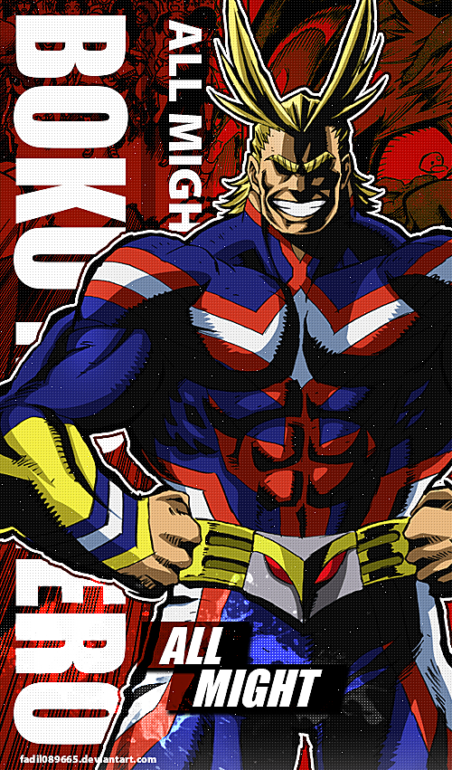
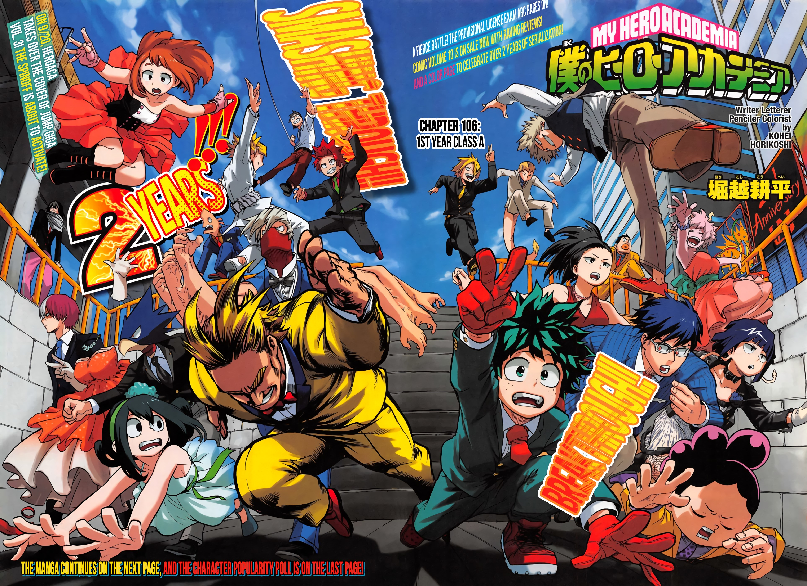
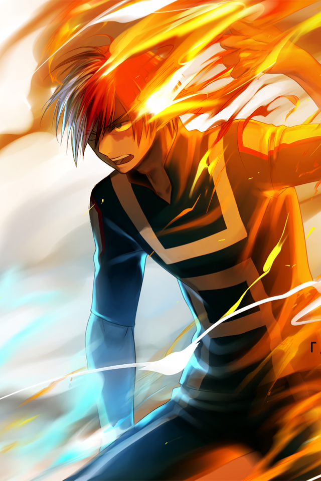
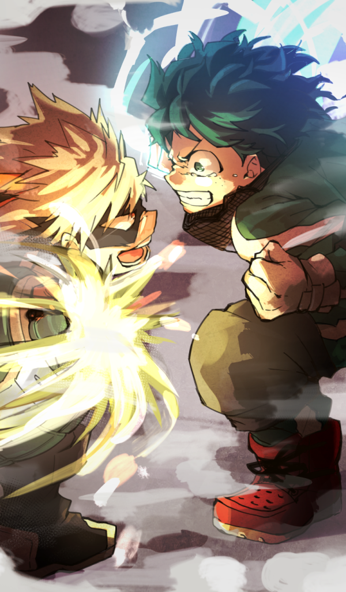
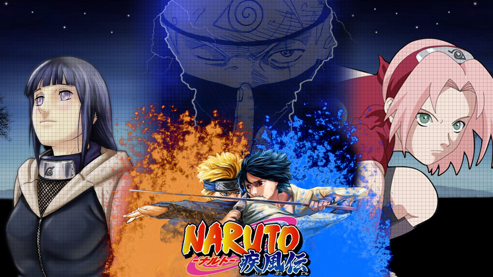

<html lang="en">
<head>
    <meta charset="UTF-8">
    <title>Title</title>
    <link rel="stylesheet" href="bootsrap/css/bootstrap.css">
    <link rel="stylesheet" href="anime.css">
    <link class="u" rel="icon" href="animeimg/heroicon.png">
</head>
<body class="body">
<nav class="navbar navbar-expand-sm bg-dark navbar-dark">
    <!-- Brand/logo -->
    

    <!-- Links -->
    <ul class="navbar-nav">
        <li class="nav-item">
            <a class="nav-link" href="index.html">HOME</a>
        </li>
        <li class="nav-item">
            <a class="nav-link" href="gallery.html">GALLERY</a>
        </li>
        <li class="nav-item">
            <a class="nav-link" href="animelibrary.html">ANIME LIBRARY</a>
        </li>
    </ul>
</nav>
    

    <h1><b>ABOUT THE ANIME</b></h1>
        

         The appearance of "quirks," newly discovered super powers, has been steadily increasing over the years, with 80 percent of humanity possessing various abilities from manipulation of elements to shapeshifting. This leaves the remainder of the world completely powerless, and Izuku Midoriya is one such individual.

    Since he was a child, the ambitious middle schooler has wanted nothing more than to be a hero. Izuku's unfair fate leaves him admiring heroes and taking notes on them whenever he can. But it seems that his persistence has borne some fruit: Izuku meets the number one hero and his personal idol, All Might. All Might's quirk is a unique ability that can be inherited, and he has chosen Izuku to be his successor!>

            Enduring many months of grueling training, Izuku enrolls in UA High, a prestigious high school famous for its excellent hero training program, and this year's freshmen look especially promising. With his bizarre but talented classmates and the looming threat of a villainous organization, Izuku will soon learn what it really means to be a hero.  

      
<h2 ><b>MAIN CHARACTERS</b></h2>
                <h3 class="w">  <b>Izuku Midoriya </b></h3>
          

              

              

                  
<b> Izuku is small for his age, his round face framed by a short mess of fluffy dark green hair which sticks up at odd angles around his head, casting noticeably dark shadows onto itself. His eyes are large and somewhat circular, their irises the same green color as his hair, and are usually stretched quite wide, giving him an innocent appearance. He has a set of four symmetrical freckles in diamond formations, one on each cheek, but despite these prominent traits, he is often described as being plain-looking. </b> 

                  

                  <a  class="btn-lg btn-danger t" href="https://bokunoheroacademia.fandom.com/wiki/Izuku_Midoriya">MORE ABOUT MIDORIYA</a>
              

          

           
          <h4 class="e"><b>ALL MIGHT</b></h4>
                

                    

                    

                        

                            <b class="r">PLUS ULTRA!!!</b>
                             
                             "The people, the heroes, even the villains, I stand to set fire in their hearts."

                     The highest ranked hero in the world and a pillar of hope and justice for heroes everywhere to follow. After an intense battle with a dangerous supervillain, he can only be his normal self for up to three hours a day. After he hits his time limit, he becomes a lanky, skeletal man who constantly coughs up blood. Only a select few staff at U.A. know this, and even fewer know the true nature of his Quirk. At the start of the story, Midoriya proves himself to All Might and inherits "One For All".
                            
                             
                            <a  class="btn-lg btn-success t" href="https://tvtropes.org/pmwiki/pmwiki.php/Characters/MyHeroAcademiaAllMight">MORE ABOUT ALL MIGHT</a>

                        
  
                

      

         
  

 
 

</body>
</html>
<html lang="en">
<head>
    <meta charset="UTF-8">
    <title>Title</title>
    <link rel="stylesheet" href="bootsrap/css/bootstrap.css">
    <link rel="stylesheet" href="anime.css">
    <link class="u" rel="icon" href="animeimg/heroicon.png">
</head>
<body id="y">

<nav class="navbar navbar-expand-sm bg-dark navbar-dark">
    <!-- Brand/logo -->
    

    <!-- Links -->
    <ul class="navbar-nav">
        <li class="nav-item">
            <a class="nav-link" href="index.html">HOME</a>
        </li>
        <li class="nav-item">
            <a class="nav-link" href="gallery.html">GALLERY</a>
        </li>
        <li class="nav-item">
            <a class="nav-link" href="animelibrary.html">ANIME LIBRARY</a>
        </li>
    </ul>
</nav>

    <!-- Indicators -->
    <ul class="carousel-indicators">
        <li data-target="#demo" data-slide-to="0" class="active"></li>
        <li data-target="#demo" data-slide-to="1"></li>
        <li data-target="#demo" data-slide-to="2"></li>
        <li data-target="#demo" data-slide-to="3"></li>
        <li data-target="#demo" data-slide-to="4"></li>
    </ul>

    <!-- The slideshow -->
    

        

            
        

        

            
        

        

            
        

    

        
    

    

        
    

    

        
    

    

        
    

    

        
    

    

        
    

    

        
    

    

    <!-- Left and right controls -->
    <a class="carousel-control-prev" href="#demo" data-slide="prev">
        
    </a>
    <a class="carousel-control-next" href="#demo" data-slide="next">
        
    </a>
    <a class="carousel-control-next" href="#demo" data-slide="next">
        
    </a>

    
<b class="o"> GO BEYOND PLUS ULTRA!!!</b>

    

    
 <b class="p"> "BECOME A HERO...GYM!!!" ALL MIGHT  
          

        </b>

        <a href="https://www.instagram.com/allmighta/"><button class=" btn-danger">ENROLL NOW!</button></a>
    

</body>
</html>
<html lang="en">
<head>
    <meta charset="UTF-8">
    <title>anime library</title>
    <link rel="stylesheet" href="bootsrap/css/bootstrap.css">
    <link rel="stylesheet" href="anime.css">
    <link class="u" rel="icon" href="animeimg/heroicon.png">
</head>
<body>

<nav class="navbar navbar-expand-sm bg-dark navbar-dark">
    <!-- Brand/logo -->
    

    <!-- Links -->
    <ul class="navbar-nav">
        <li class="nav-item">
            <a class="nav-link" href="index.html">HOME</a>
        </li>
        <li class="nav-item">
            <a class="nav-link" href="gallery.html">GALLERY</a>
        </li>
        <li class="nav-item">
            <a class="nav-link" href="animelibrary.html">ANIME LIBRARY</a>
        </li>
    </ul>
</nav>

    
<h1><b>OTHER ANIMES INCLUDE:</b></h1>

     
    
<h6><b class="j k">NARUTO UZAMAKI </b></h6>

    

        

            

        

        

            

                Moments prior to Naruto Uzumaki's birth, a huge demon known as the Kyuubi, the Nine-Tailed Fox, attacked Konohagakure, the Hidden Leaf Village, and wreaked havoc. In order to put an end to the Kyuubi's rampage, the leader of the village, the Fourth Hokage, sacrificed his life and sealed the monstrous beast inside the newborn Naruto.

                Now, Naruto is a hyperactive and knuckle-headed ninja still living in Konohagakure. Shunned because of the Kyuubi inside him, Naruto struggles to find his place in the village, while his burning desire to become the Hokage of Konohagakure leads him not only to some great new friends, but also some deadly foes.
            

        

    

</body>
</html>
